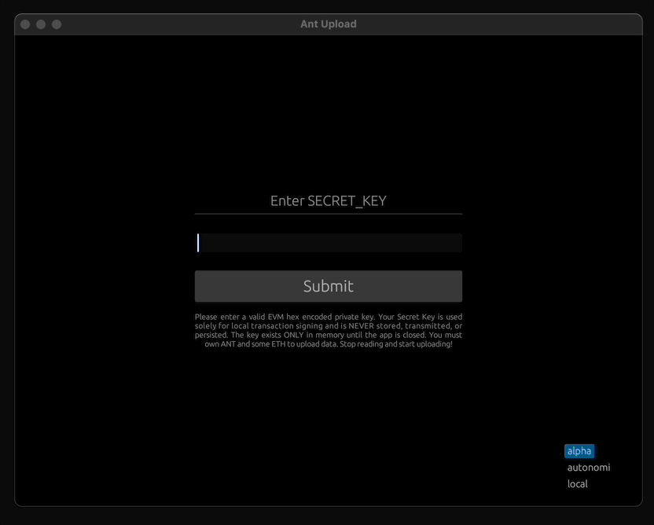

# Ant Upload

Share your files with the world — one drag and drop to eternal access.

Censorship-proof, universally available, and free for everyone.

Pay once to upload — downloads stay free forever.

Liberate the world's knowledge — give it back to everyone



## Download it

[Download the latest release](https://github.com/maidsafe/ant-upload/releases/latest)

> Mac users might face quarantine issues: `"AntUpload.app" is damaged and can't be opened. You should move it to the Trash.`
> To fix this:
> 1. **Unzip** the file (double-click the `.zip`).
> 2. Open **Terminal** (press `Cmd + Space`, type "Terminal", and press Enter).
> 3. Go to your Downloads folder:
>   ```bash
>   cd ~/Downloads
>   ```
> 4. Remove macOS quarantine flag:
>   ```bash
>   xattr -rd com.apple.quarantine AntUpload.app
>   ```
> 5. Double-click **AntUpload.app** to open it!

## Build it from source

```bash
# currently uses the bleeding edge of the autonomi API which will eventually be released but for avant-garde users here's a how to guide

# clone the autonomi repo and use the client-light-networking branch
git clone https://github.com/maidsafe/autonomi.git 
cd autonomi
git fetch origin client-light-networking 
git checkout client-light-networking

# go back into the ant-upload directory
cd ..

# build the release version of the app
cargo build --release
```

## Run it from source

```bash
cargo run --release
```

## For those diving into the code

- The `src/server.rs` file contains the main logic for all autonomi network interaction
- The `src/main.rs` 90% AI vibe-coded front-end for the app

## Coming soon

- Use the public Autonomi API release instead of the bleeding edge client-light-networking branch
- Windows binary releases (need help here)
- Download files from the Autonomi Network
- A repository of all shared files
- Suggest more features by submitting or upvoting an issue on github
